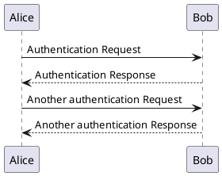
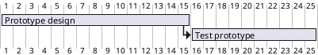
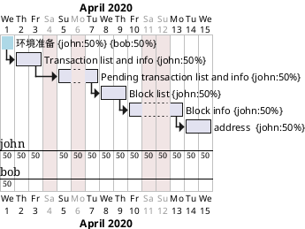

```plantuml

@startuml
Alice -> Bob: Authentication Request
Bob --> Alice: Authentication Response
Alice -> Bob: Another authentication Request 
Alice <-- Bob: Another authentication Response 
@enduml

```

```plantuml
@startgantt
[Prototype design] as [D] lasts 15 days 
[Test prototype] as [T] lasts 10 days 
[T] starts at [D]'s end
@endgantt
```

```plantuml
@startgantt
project starts the 2020/4/1
saturday are closed
sunday are closed
2020/4/6 are closed
2020/4/5 are open

[环境准备] is colored in lightblue
[环境准备] on {john:50%}{bob:50%} lasts 1 days
then [Transaction list and info] on {john:50%} lasts 1 days
then [Pending transaction list and info] on {john:50%} lasts 1 days
then [Block list] on {john:50%} lasts 1 days
then [Block info] on {john:50%} lasts 1 days
then [address ] on {john:50%} lasts 1 days

@endgantt
```