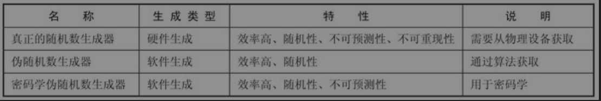

[TOC]

# 前端加解密

参考文档：
SubtleCrypto：[https://developer.mozilla.org/zh-CN/docs/Web/API/SubtleCrypto](https://developer.mozilla.org/zh-CN/docs/Web/API/SubtleCrypto)
RSA算法原理：[https://cjting.me/2020/03/13/rsa/](https://cjting.me/2020/03/13/rsa/)
DH算法原理：https://blog.csdn.net/mrpre/article/details/52608867
web cryptography API：https://www.theseus.fi/bitstream/handle/10024/92960/Web_Cryptography_API_Luoma-aho.pdf
《深入浅出https》
《java加密与解密艺术》
《Understanding-Cryptography》


## 前言


* x 明文,
* y 是秘文,
* k 是密钥,
* k的所有可能，组合成密钥空间

### 简单对称加密方法：替换密码和移位密码

  * 替换密码,比如：A→k B→d C→w ...

  * 移位密码,如凯撒加密，右移3位
  
  但这些可以暴力破解，或通过字母出现的概率进行分析破解，比如英文单词里e的出现频率最高。


## 加解密基础概念

根据克劳德·香农的信息理论，强加密算法的两个原操作：

1. **Confusion** is an encryption operation where the relationship between key and ciphertext is obscured. Today, a common element for achieving confusion is substitution, which is found in both DES and AES.
2. **Diffusion** is an encryption operation where the influence of one plaintext symbol is spread over many ciphertext symbols with the goal of hiding statistical properties of the plaintext. A simple diffusion element is the bit permutation, which is used frequently within DES. AES uses the more advanced Mixcolumn operation.

翻译过来：
* 明文和密文关系模糊，使攻击者很难分析，比如在DES和AES里通过替换等方式实现。
* 明文的每一位改动都要对最后的密文产生很大的影响，比如DES通过位置换

密码学主要解决四个问题：

1. 机密性(加解密)
这是我们最先想到的，传输的信息是一串无意义的数字，只有秘钥才能解开
2. 完整性(MAC消息验证,hash)
如果有中间人企图篡改,接受者能够知道
3. 身份验证(数字签名)
发送方和接收方能确认对方身份
4. 不可抵赖性(数字签名)
  行为不可抵赖

> 对称和非对称算法密钥长度不同，80位的对称密钥和1024位的RSA安全性相当。

### 随机数


+ TRNG 抛硬币，抛骰子，放射性衰变...
+ PRNG的一个例子就是ANSI C里的rand()函数
s0 = 12345
si+1 ≡ 1103515245si +12345 mod 231, i = 0,1,...
+ CPRNG是PRNG的一个特例，给定前序密钥序列，不可计算出后续位。只有密码学中才要求CPRNG

不管是真正的随机数生成器TRNG（True Random Number Generator），伪随机数生成器PRNG（Preudo Random Number Generator），还是密码学伪随机数生成器CPRNG（Cryptography secure Preudo Random Number Generator），内部工作原理是一样的，CPRNG是PRNG随机数生成器中的一种。
随机数生成器内部会维护一个状态（internal state），对于TRNG来说，内部状态的数值来自外部设备，称为熵（entrory），比如动态的时间、变化的温度、声音的变化、鼠标位置。
而对于PRNG来说，内部状态的数值来自于模拟的数值，称为种子（seed）。随机数生成器每次生成随机数的时候，内部状态的值都会变化，这样才能产生不一样的随机数，如果每次

熵和种子是一样的，生成的随机数也是相同的，所以熵和种子对于随机数生成器非常重要。
一个优秀的随机数生成器就在于寻找尽可能多的熵和种子，一旦熵和种子不够，随机数生成器就会停止运行。


>我们不用关心这些，各语言的加解密库一般提供了密码学安全的随机数生成方法

### 流密码和分组密码

* 流密码(stream cipher) A5/1,RC4等,多用于手机端，效率高，对资源比较少的设备比较合适。但目前RC4已经证实不安全。
  + OTP(一次一密)，无条件安全(不考虑计算资源的情况下安全)
    - 真随机数生成器得到密钥序列s0,s1,s2....
    - 只有合法的通信方才知道密钥序列
    - 每个密钥序列只使用一次
    y0 = x0 + s0 mod 2
    y1 = x1 + s1 mod 2
    ...
    OTP是无条件安全的
    不实用(据说冷战期间白宫和克里姆林宫之间的红色电话就是OTP)，第三条，最严重。密钥长度必须和消息长度相等。

    采用PRNG和CPRNG生成的就实用的多，只需要提供一个种子key,密钥比消息短的多
    

* 分组密码(block cipher),或块密码。有很多迭代模式:
  + ECB(不安全)
   

    - 将明文拆分成多个数据块，每个数据块的长度等于分组长度，如果最后一个数据块长度小于分组长度，需要进行填充保证最后一个数据块长度等于分组长度。
    - 依次对每个数据块进行迭代得到每个数据块的密文分组，将所有密文分组组合在一起就得到最终的密文，密文长度等同于明文长度。

    ECB模式最大的特点就是每个迭代过程都是独立的，是可以并行处理的，能够加快运算速度。由于固定的明文和密钥每次运算的结果都是相同的，这会造成很多安全问题。
  + CBC
   
  引入初始化向量(IV)
  初始化向量必须每次都不一样，有了随机的初始化向量，同样的明文和密钥最终得到的密文是不一样的，解决了ECB模式存在的安全问题。
  [does-iv-work-like-salt?](https://stackoverflow.com/questions/1949640/does-iv-work-like-salt)
  + CTR
  
    
    - 密文拆分成多个数据块，和CBC迭代不一样的是不需要进行填充处理。
    - 在处理迭代之前，先生成每个密钥流，有n个数据块，就有n个密钥流。根据第n个密钥流可以得到第n+1个密钥流，最简单的方式就是密钥流每次递增加一。
    - 第一个密钥流的获取方式也很简单，就是生成一个随机值（Nonce），Nonce和IV可以等同理解，一个不容易推导出来的随机值。
    - 接下来进行迭代加密处理，密钥流和密钥进行处理，得到的值再和数据块进行XOR运算（每次迭代相当于流密码运行模式）得到密文分组。
    - 迭代运行每个数据块，最终得到密文。

  
  
* 填充标准

 明文必须是分组的倍数，如果不是，就需要填充。有一些标准定义了如何进行填充：PKCS#7和PKCS#5里面有定义填充标准

 最简单的方式都填充0，但如果明文本身末尾有0，解密出来的就不是原文了

 PKCS#7 很简单，根据填充的字节数量进行对应的填充，如果填充的字节长度n是3，填充的值就是030303；如果n是5，那么填充的值就是0505050505，填充值最后一个字节代表的就是实际填充的长度。

 PKCS#5和PKCS#7处理填充机制的方式其实是一样的，只是PKCS#5处理的分组长度只能是8字节，而PKCS#7处理的分组长度可以是1到255任意字节，从这个角度看，可以认为PKCS#5是PKCS#7标准的子集。AES算法中分组长度没有8字节，所以AES算法使用PKCS#7标准。

 + 其他pkcs标准(publick key crytography standards):

 


### 对称加密

* DES(不安全),3DES
* AES(推荐替代DES的算法)

内部实现很复杂,略

DES已被破解

### 非对称加密

* RSA
* DH(Diffie-Hellman)
* Elgamal
* ECC


#### RSA

```c
typedef struct rsa_st {
    BIGNUM *p;
    BIGNUM *q;
    BIGNUM *n;
    BIGNUM *e;
    BIGNUM *d;
} RSA;
```
* 选取两个很大的质数p和q
* 求这两个数的乘积n
* 取一个公开指数e，这个数的值小于(p-1)(q-1)，e对应的值和(p-1)(q-1)的值互质
* e和n组合起来就相当于公钥，n值的长度就相当于密钥对的长度
* 通过e、p、q能够计算出私钥d，d和n组合起来就是私钥。一旦计算出私钥，p和q这两个数就可以丢弃，这样更安全。如果不丢弃且和d一同保存在私钥文件中，则运算时效率更高。e和d之间存在互逆的关系。

[n,e]就是公钥
[n,d]就是私钥

想知道d需要对n进行质数分解，n是个大整数，所以相当困难。

RSA原理(很容易理解)：
[https://cjting.me/2020/03/13/rsa](https://cjting.me/2020/03/13/rsa/)

* 素性测试-->费马测试等等

#### DH(Diffie-Hellman)秘钥交换算法 和 DLP
Alice 和Bob想要在一个不安全的信道共享一个密钥？

[DH算法原理](https://blog.csdn.net/mrpre/article/details/52608867) (也很容易理解)

设 已知 二元组(q, p)

Alice 生成随机值a，计算q^a mod p = Ga

Bob  生成随机值b， 计算q^b mod p = Gb

Alice 计算Sa =Gb^a mod p

Bob 计算Sb = Ga^b mod p

a,b私钥，Ga,Gb是公钥，计算出a和b是相当困难

**Sa = Sb ?**

[DLP离散对数问题](https://www.cnblogs.com/math/p/discrete-log.html)


群，阿尔贝群等等，域....不展开

加了模运算的对数运算是相当难的，比大整数质数分解还要难！NP问题

基于ECC的DH,ECDH


#### ECC
* 椭圆加密的密钥更短
* 椭圆加密计算更快而安全性相当
* RSA的私钥和公钥是可以互换加解密的(私钥加密意义何在？)

ECC没有直接提供一个加密方法，但我们可以使用ECDH产生一个共有的密钥，然后用对称加密方案进行加密

>非对称秘钥方案都基于**单向函数f(x)**,求解其逆函数f(x)^-1的解相当困难
RSA基于大整数分解，DH,ECC和ElGamal都是基于离散对数问题 
ps：或许哪天出现了好的数学方法来解决这些问题，那这些加密方案将都不再安全


Ecc原理解析：
[https://zhuanlan.zhihu.com/p/103665076](https://zhuanlan.zhihu.com/p/103665076)

#### 应用
 >实际应用中，我们通常使用非对称加密方案来加解密对称秘钥，再由对称秘钥对明文进行加解密

加密：


解密：


### 数字签名

数字签名技术有以下几个特点。
+ 防篡改：数据不会被修改，MAC算法也有这个特点。
+ 防抵赖：消息签署者不能抵赖。
+ 防伪造：发送的消息不能够伪造，MAC算法也有这个特点。

RSA
DSA
ECDSA:(r,s,v) 略

v = 27 + (y % 2)

### 哈希函数


密码学Hash算法的主要特性如下：
* 相同的消息总是能得到同样的摘要值，特定的Hash算法，不管消息长度是多少，最终的摘要值长度是相同的。
* 不管多长的消息，Hash运算非常快速，这是非常重要的特性。
* 通过摘要值很难逆向计算出原始消息，Hash算法具备单向性，摘要值是不可逆的，这也是非常重要的特性。为了逆向计算出原始消息，唯一的方法就是采用暴力攻击、字典攻击、彩虹表，对不同的消息组合进行迭代运算，运算的结果如果匹配该消息的摘要值，表示该Hash算法不应该用于密码学。
* 原始消息一旦修改，即使是很轻微的修改，最终的摘要值也会产生变化。
* 很难找出两个不同的消息，并且它们的摘要值是相同的。
从密码学的角度考虑，Hash算法能够实现密码学的某个目标，那就是消息防篡改，由于Hash算法的特性比较多，基于Hash算法有很多的应用场景，下面列举几个常见的例子。

主要用途：
1. 文件比较
比如我们项目中的文件进行md5
2. 身份验证
对密码进行hash，存储到数据库。这样既是数据库泄露,攻击者也得不到原始密码


MD5是不安全的
目前SHA1已经被攻破，SHA2被攻破只是时间问题。

### 消息验证码(MAC)

不细讲，只提和hash的区别：
消息认证码(mac)是带密钥的，
hashes 用于保证数据的完整性， MAC 保证完整性和身份验证
构造方法上通常基于Hash函数，比如HMAC,MDx-MAC。也可以基于分组密码比如CBC类的MAC，还有就是基于泛Hash函数族。


### https和数字证书


TSL内部就有各种密码套件，实现安全传输

数字证书就类似于我们的身份证，用来标识网络中的用户(计算机)身份

可以看下百度的证书链。


### 其他
#### base64和其他编码

[ASN.1, DER, PEM, X509](https://blog.csdn.net/codehat/article/details/78592144?utm_source=blogxgwz7)

##### base64的由来

Base64算法最早应用于解决电子邮件传输的问题。在早期，由于“历史问题”，电子邮件只允许ASCII码字符。如果要传输一封带有非ASCII码字符的电子邮件，当它通过有“历史问题”的网关时就可能出现问题。这个网关很可能会对这个非ASCII码字符的二进制位做调整，即将这个非ASCII码的8位二进制码的最高位置为0。此时用户收到的邮件就会是一封纯粹的乱码邮件了。基于这个原因产生了Base64算法。


余数 = 原文字节数 mod 3

余数为0 则没有等号
余数为1 则要补2个等号
余数为2 则要补1个等号

#### Buffer ArrayBuffer typedArray

JS里的Array，因为有很多功能，而且是不限制类型的，或者它还可能是稀疏的(和java和c++等区别)……总之这个Array是“托管”的，它内部有比较复杂的实现。而如果你从XHR、File API、Canvas等等各种地方，读取了一大串字节流，如果用JS里的Array去存，又浪费，又低效。于是为了配合这些新的API增强JS的二进制处理能力，就有了ArrayBuffer。


1. ArrayBuffer对象：代表内存之中的一段二进制数据，可以通过“视图”进行操作。“视图”部署了数组接口，这意味着，可以用数组的方法操作内存。

2. TypedArray对象：用来生成内存的视图，通过9个构造函数，可以生成9种数据格式的视图，比如Uint8Array（无符号8位整数）数组视图, Int16Array（16位整数）数组视图, Float32Array（32位浮点数）数组视图等等。

3. DataView对象：用来生成内存的视图，可以自定义格式和字节序，比如第一个字节是Uint8（无符号8位整数）、第二个字节是Int16（16位整数）、第三个字节是Float32（32位浮点数）等等。

简单说，ArrayBuffer对象代表原始的二进制数据，TypedArray对象代表确定类型的二进制数据，DataView对象代表不确定类型的二进制数据。它们支持的数据类型一共有9种（DataView对象支持除Uint8C以外的其他8种）

[arrayBuffer详解](https://javascript.ruanyifeng.com/stdlib/arraybuffer.html)

在Node.js 里有一个与ArrayBuffer 相似的类叫做Buffer，但更强大一些。

## js加解密

* 随着数据安全的需求提高，另外加上js的流行，出现越来越多的前端富应用。用户对客户端加密/前端(浏览器端)加密的需求越来越强。
* 在已经有https(ssl/tsl)传输的基础上，前端的加解密是否必要？
 对于这个问题，我认为有个恰当的比喻：
 > 谁都知道小偷可以翻窗户进来，但出门的时候没人会不锁门
 
* js的加解密有很多弊端，比如：
    + 缺少密码学安全的随机数生成器(CSPRNG)
    + 缺少安全的私钥存储机制
    + 不可预估的计算性能瓶颈

* 一些流行的js加解密库：
[Stanford JavaScript Crypto Library(sjcl)](https://github.com/bitwiseshiftleft/sjcl)
[CryptoJS](https://github.com/brix/crypto-js)
[Forge](https://github.com/digitalbazaar/forge)


### nodejs

基于openssl，底层是C封装。

具体API见官网 [crypto api](https://nodejs.org/dist/latest-v12.x/docs/api/crypto.html)

### webCrypto

* [SubtleCrypto](https://developer.mozilla.org/zh-CN/docs/Web/API/SubtleCrypto),比较新的API，浏览器中的支持情况如下图


开发者需要熟知浏览器环境的安全常识:

* HTTP Strict Transport Security standard (HSTS)

规则让浏览器知道网站只能通过http安全连接来访问

* Content Security Policy (CSP)

规则通知浏览器应该从何处加载资源

* HTTP Public Key Pinning (HPKP)

它允许web主机运营商指导用户代理在一段时间内强制使用特定的加密身份，从而有效地减轻某些中间人攻击

* Subresource integrity (SRI)

它允许用户代理在不进行意外操作的情况下验证获取的资源是否已被传递。

签名验签
  ```js
const enc = new TextEncoder();
const encodedMessage = enc.encode('hello');
console.log(encodedMessage)
const keyPair = window.crypto.subtle.generateKey({
    name: "RSASSA-PKCS1-v1_5",
    modulusLength: 4096,
    publicExponent: new Uint8Array([1, 0, 1]),
    hash: "SHA-256"
  },
  true,
  ["sign", "verify"]
);
(async () => {
  const {
    privateKey,
    publicKey
  } = await keyPair;
  const signature = await window.crypto.subtle.sign(
    "RSASSA-PKCS1-v1_5",
    privateKey,
    encodedMessage
  );
  const signatureValid = await window.crypto.subtle.verify("RSASSA-PKCS1-v1_5", publicKey, signature, encodedMessage);
  console.log(signatureValid);
})()
  ```
加密解密
  ```js
  const enc = new TextEncoder();
const dec = new TextDecoder();
const keyPair = window.crypto.subtle.generateKey({
    name: "RSA-OAEP",
    modulusLength: 4096,
    publicExponent: new Uint8Array([1, 0, 1]),
    hash: "SHA-256"
  },
  true,
  ["encrypt", "decrypt"]
);
const encodedMessage = enc.encode('hello');
(async () => {
  const {
    privateKey,
    publicKey
  } = await keyPair;
  const encryptedText = await window.crypto.subtle.encrypt({
      name: "RSA-OAEP"
    },
    publicKey,
    encodedMessage
  )
  console.log(encryptedText);
  const decryptedText = await window.crypto.subtle.decrypt({
      name: "RSA-OAEP"
    },
    privateKey,
    encryptedText
  )
  console.log(decryptedText);
  console.log(dec.decode(decryptedText));
})()
  ```

[生成随机数](https://developer.mozilla.org/zh-CN/docs/Web/API/RandomSource/getRandomValues)
  ```js
  let array = new Uint32Array(10);
  window.crypto.getRandomValues(array);
  for (const num of array) {
    console.log(num);
  }
  ```
  