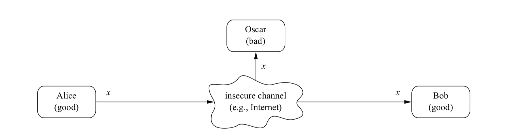
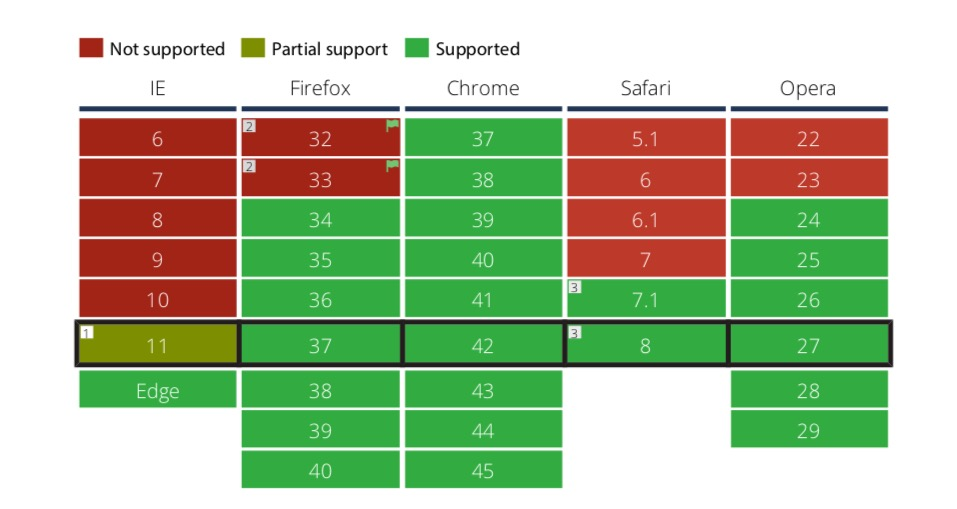

# 白话前端加解密

## 前言




* x 明文,
* y 是秘文,
* k 是密钥,
* k的所有可能，组合成密钥空间

### 简单对称加密方法：替换密码和移位密码

  * 替换比如：A→k B→d C→w ...

  * 移位密码如凯撒加密，右移3位
  
  但这些可以暴力破解，或通过字母出现的概率进行分析破解，比如英文单词里e的出现频率最高。


## 加解密基础概念

* 
* 对称和非对称算法密钥长度不同，80位的对称密钥和1024位的RSA安全性相当。

* 流密码(stream cipher) RC4,多用于手机端，效率高，对资源比较少的设备比较合适
* 分组密码(block cipher)

### 对称加密

* DES(不安全),3DES
* AES
很难


### 非对称加密
* RSA
* DH(Diffie-Hellman)
* Elgamal
* ECC

#### RSA

```c
typedef struct rsa_st {
    BIGNUM *p;
    BIGNUM *q;
    BIGNUM *n;
    BIGNUM *e;
    BIGNUM *d;
} RSA;
```
* 选取两个很大的质数p和q
* 求这两个数的乘积n
* 取一个公开指数e，这个数的值小于(p-1)(q-1)，e对应的值和(p-1)(q-1)的值互质
* e和n组合起来就相当于公钥，n值的长度就相当于密钥对的长度
* 通过e、p、q能够计算出私钥d，d和n组合起来就是私钥。一旦计算出私钥，p和q这两个数就可以丢弃，这样更安全。如果不丢弃且和d一同保存在私钥文件中，则运算时效率更高。e和d之间存在互逆的关系。


#### ECC
* 椭圆加密的密钥更短
* 椭圆加密计算更快而安全性相当
* RSA的私钥和公钥是可以互换加解密的(私钥加密意义何在？)

ECC没有直接提供一个加密方法，但我们可以使用ECDH产生一个共有的密钥，然后用对称加密方案进行加密

加密：


解密：


### 数字签名
ECDSA:(r,s,v)

v = 27 + (y % 2)

### 哈希函数
MD sha-1系列
目前SHA1已经被攻破，SHA2被攻破只是时间问题。

### 消息验证码

### 数字证书

### base64和其他

[ASN.1, DER, PEM, X509](https://blog.csdn.net/codehat/article/details/78592144?utm_source=blogxgwz7)


## js加解密

* 随着数据安全的需求提高，另外加上js的流行，出现越来越多的前端富应用。用户对客户端加密/前端(浏览器端)加密的需求越来越强。
* 在已经有https(ssl/tsl)传输的基础上，前端的加解密是否必要？
* js的加解密有很多弊端，比如：
    + 缺少密码学安全的随机数生成器(CSPRNG)
    + 缺少安全的私钥存储机制
    + 不可预估的计算性能瓶颈
* 一些流行的js加解密库：
[Stanford JavaScript Crypto Library(sjcl)](https://github.com/bitwiseshiftleft/sjcl)
[CryptoJS](https://github.com/brix/crypto-js)
[Forge](https://github.com/digitalbazaar/forge)


### nodejs

基于openssl，底层是C封装。

具体API见官网 [crypto api](https://nodejs.org/dist/latest-v12.x/docs/api/crypto.html)

### webCrypto

* [SubtleCrypto](https://developer.mozilla.org/zh-CN/docs/Web/API/SubtleCrypto),比较新的API，浏览器中的支持情况如下图



开发者需要熟知浏览器环境的安全常识:

* HTTP Strict Transport Security standard (HSTS)

规则让浏览器知道网站只能通过http安全连接来访问

* Content Security Policy (CSP)

规则通知浏览器应该从何处加载资源

* HTTP Public Key Pinning (HPKP)

它允许web主机运营商指导用户代理在一段时间内强制使用特定的加密身份，从而有效地减轻某些中间人攻击

* Subresource integrity (SRI)

它允许用户代理在不进行意外操作的情况下验证获取的资源是否已被传递。

签名验签
  ```js
const enc = new TextEncoder();
const encodedMessage = enc.encode('hello');
console.log(encodedMessage)
const keyPair = window.crypto.subtle.generateKey({
    name: "RSASSA-PKCS1-v1_5",
    modulusLength: 4096,
    publicExponent: new Uint8Array([1, 0, 1]),
    hash: "SHA-256"
  },
  true,
  ["sign", "verify"]
);
(async () => {
  const {
    privateKey,
    publicKey
  } = await keyPair;
  const signature = await window.crypto.subtle.sign(
    "RSASSA-PKCS1-v1_5",
    privateKey,
    encodedMessage
  );
  const signatureValid = await window.crypto.subtle.verify("RSASSA-PKCS1-v1_5", publicKey, signature, encodedMessage);
  console.log(signatureValid);
})()
  ```
加密解密
  ```js
  const enc = new TextEncoder();
const dec = new TextDecoder();
const keyPair = window.crypto.subtle.generateKey({
    name: "RSA-OAEP",
    modulusLength: 4096,
    publicExponent: new Uint8Array([1, 0, 1]),
    hash: "SHA-256"
  },
  true,
  ["encrypt", "decrypt"]
);
const encodedMessage = enc.encode('hello');
(async () => {
  const {
    privateKey,
    publicKey
  } = await keyPair;
  const encryptedText = await window.crypto.subtle.encrypt({
      name: "RSA-OAEP"
    },
    publicKey,
    encodedMessage
  )
  console.log(encryptedText);
  const decryptedText = await window.crypto.subtle.decrypt({
      name: "RSA-OAEP"
    },
    privateKey,
    encryptedText
  )
  console.log(decryptedText);
  console.log(dec.decode(decryptedText));
})()
  ```

生成随机数
  ```js
  let array = new Uint32Array(10);
  window.crypto.getRandomValues(array);
  for (const num of array) {
    console.log(num);
  }
  ```
  